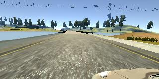
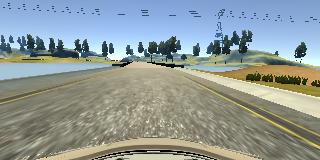
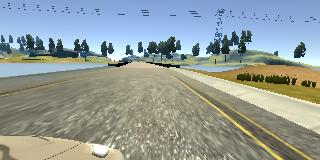
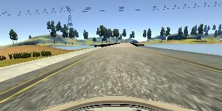

# Behavioral Cloning Project

The goals / steps of this project are the following:

(1) Use the simulator to collect data of good driving behavior

(2) Build, a convolution neural network in Keras that predicts steering angles from images

(3) Train and validate the model with a training and validation set

(4) Test that the model successfully drives around track one without leaving the road

(5) Summarize the results with a written report

## Files Submitted & Code Quality

### 1. Submission includes all required files and can be used to run the simulator in autonomous mode

My project includes the following files:

train.py containing the script to create and train the model

drive.py for driving the car in autonomous mode

video.py for creating the movie file

model.h5 containing a trained convolution neural network

report.pdf summarizing the results

run1.mp4 movie file recording the drive

### 2. Submission includes functional code

With the command “python3 drive.py model.h5”, the car can drive automatically in the simulator provided by Udacity.

### 3. Submission code is usable and readable

The codes for constructing and training convolutional neural networks are in train.py with appropriate comments.

## Model Architecture and Training Strategy

### 1. An appropriate model architecture has been employed

See answer to the second bullet point in the section “Model Architecture and Training Strategy”.

### 2. Attempts to reduce overfitting in the model

I split data into 80% training and 20% validation. I augmented data by flipping image horizontally. I also used images from left and right cameras.

### 3. Model parameter tuning

The model used an Adam optimizer.

### 4. Appropriate training data

First, data augmentation was done by flipping image horizontally and used images from left and right camera. Then, 80% of the data were used as training data.

## Model Architecture and Training Strategy

### 1. Solution Design Approach

The basic idea is to reproduce an existing network structure, which has been proven to be successful in scientific community. The network in Bojarski et al.’s “End to End Learning for Self-Driving Cars” was introduced, with which the authors achieved an autonomy value of 90%.

### 2. Final Model Architecture

Layer 1: Lambda layer to normalize input to [-0.5, 0.5]

Layer 2: Cropping layer to crop the top and bottom part of the image

Layer 3: Convolutional layer with 24 output channels, 5*5 kernel size, stride of 2 and ReLU activation.

Layer 4: Convolutional layer with 36 output channels, 5*5 kernel size, stride of 2 and ReLU activation.

Layer 5: Convolutional layer with 48 output channels, 5*5 kernel size, stride of 2 and ReLU activation.

Layer 6: Convolutional layer with 64 output channels, 3*3 kernel size, stride of 1 and ReLU activation.

Layer 7: Convolutional layer with 64 output channels, 3*3 kernel size, stride of 1 and ReLU activation.

Layer 8: Flatten layer 7, and fully connected with 1164 neurons

Layer 9: Fully connected layers with 100 neurons

Layer 10: Fully connected layers with 50 neurons

Layer 11: Fully connected layers with 10 neurons

Layer 12: Output

### 3. Creation of the Training Set & Training Process

First, all images from the center camera, left camera, and right camera were loaded. After several tests, the correction angle value for left and right camera was chosen to be 0.15. Here is an example of the same frame from left, center and right camera:

Left:

Center:

Right:

Then, image augmentation was performed by flipping image horizontally. Here is an example of image before and after flipping:
Before:

Afeter:

Finally, all data were randomly shuffled an split into 80% training and 20% validation.

The Adam optimizer was used in the training and the mean square error was used as loss function. The training was performed with a batch size of 32 and the process consists of 4 epochs.

