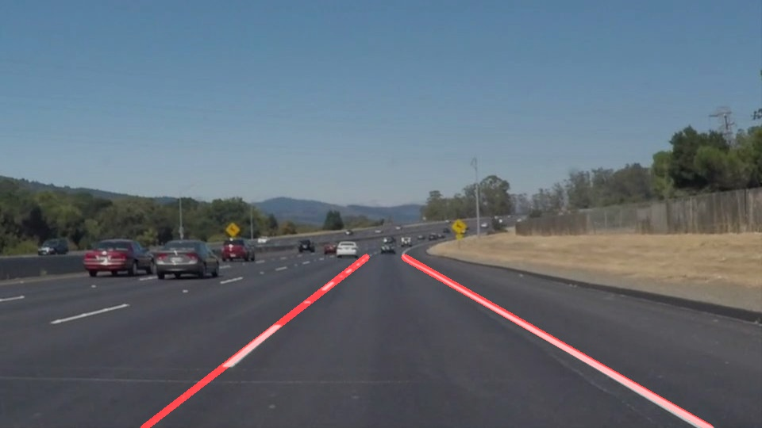

# **Finding Lane Lines on the Road** 

## Overview

When we drive, we use our eyes to decide where to go.  The lines on the road that show us where the lanes are act as our constant reference for where to steer the vehicle.  Naturally, one of the first things we would like to do in developing a self-driving car is to automatically detect lane lines using an algorithm.

In this project you will detect lane lines in images using Python and OpenCV.  OpenCV means "Open-Source Computer Vision", which is a package that has many useful tools for analyzing images.  

To complete the project, two files will be submitted: a file containing project code and a file containing a brief write up explaining your solution. We have included template files to be used both for the [code](https://github.com/udacity/CarND-LaneLines-P1/blob/master/P1.ipynb) and the [writeup](https://github.com/udacity/CarND-LaneLines-P1/blob/master/writeup_template.md).The code file is called P1.ipynb and the writeup template is writeup_template.md 

To meet specifications in the project, take a look at the requirements in the [project rubric](https://review.udacity.com/#!/rubrics/322/view)

## Reflection

### 1. Describe your pipeline. As part of the description, explain how you modified the draw_lines() function.

My pipeline consisted of 5 steps. First, I converted the images to grayscale, then I used Gaussian smooth to blur the image. Afterwards, the Canny edge detection was applied to obtain the gradient image. In the gradient image, only the region of interest was selected for further analysis, and the region of interest was defined by a polygon with four vertices. Next, the line segments in the gradient image were detected by Hough transform.

In order to draw a single line on the left and right lanes, I modified the draw_lines() function. First, any lines with an absolute slope less than 0.5 were abandoned. Then, if a line has a negative slope, its two end points were added to a list containing points of left lane, otherwise they were added to right lane list. Afterwards, linear regression was applied on left lane list and right lane list. Finally, only two end points were obtained by using the linear regression equation for each of left and right lane, and the line connecting these two points were draw on the original image.

Here is an example image and the image after being processed by the pipeline

### 2. Identify potential shortcomings with your current pipeline

One potential shortcoming would be if the camera on the car is at a different position, the region of interest of the image will be changed and my pipeline may fail.

Another shortcoming could be if the lane has a very small turning radius, my pipeline may only be able to detect a relatively short length of the lane ahead.

### 3. Suggest possible improvements to your pipeline

A possible improvement would be to detect region of interest on the fly. Or we could use a very large region of interest and find out those most relevant lines.

Another potential improvement could be to use the curvature of current lane to predict the direction of next section of the lane.

