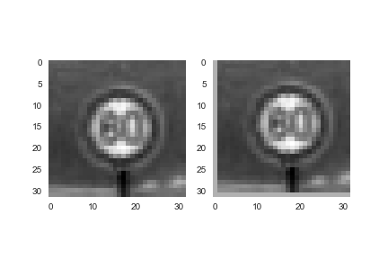
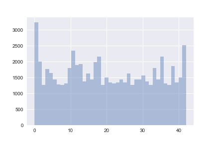
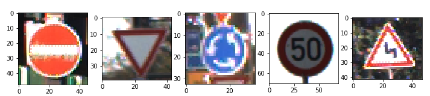

# Project: Build a Traffic Sign Recognition Program

## Data Set Summary & Exploration 

### 1. Provide a basic summary of the data set. In the code, the analysis should be done using python, numpy and/or pandas methods rather than hardcoding results manually.

I used the numpy library to calculate summary statistics of the traffic signs data set:
The size of training set is 34799
The size of the validation set is 4410
The size of test set is 12630
The shape of a traffic sign image is (32, 32, 3)
The number of unique classes/labels in the data set is 43

### 2. Include an exploratory visualization of the dataset.

Here is a histogram of classes/labels of training, validation and test set. 
Training:

 

Validation:

 

Test: 

 

From the above three figures, we know that training, validation and test sets have similar class distribution. However, the number of examples of each class is highly unbalanced. We need to upsample the minor classes to achieve a good performance.

## Design and Test a Model Architecture

### 1. Describe how you preprocessed the image data. What techniques were chosen and why did you choose these techniques? Consider including images showing the output of each preprocessing technique. Pre-processing refers to techniques such as converting to grayscale, normalization, etc. (OPTIONAL: As described in the "Stand Out Suggestions" part of the rubric, if you generated additional data for training, describe why you decided to generate additional data, how you generated the data, and provide example images of the additional data. Then describe the characteristics of the augmented training set like number of images in the set, number of images for each class, etc.)

As a first step, I decided to convert the images to grayscale because in the paper by Pierre Sermanet and Yann LeCun, using gray scale images have better performance than using color images. 
Here is an example of a traffic sign image before and after gray scaling.

 

Then, I normalized images to the range between -1 and 1, because converting inputs between 
-1 and 1 will make training of neural networks faster.

I decided to generate additional data because the number of examples of each class is highly unbalanced and this will harm the performance of the model. To add more data to the data set, I used three techniques to randomly perturb a sample image,

Random scaling:

 

Random rotation:

 

Random translation

 

I augmented those classes that have less than 1200 samples to 1200, and here is the histogram of number of samples for training set after data augmentation:

### 2. Describe what your final model architecture looks like including model type, layers, layer sizes, connectivity, etc.) Consider including a diagram and/or table describing the final model.

My final model consisted of the following layers:

1. 5 * 5 Conv, 6 channels, valid padding, ReLu activation

2. 2 * 2 Max pooling, stride 2

3. 5 * 5 Conv, 6 channels, valid padding, ReLu activation

4. 2 * 2 Max pooling, stride 2

5. 1 * 1 Conv, 400 channels, valid padding, ReLu activation

6. Flatten features from 2 and 5, then concatenate

7. Dropout

8. Fully connected layer, 43 outputs

### 3. Describe how you trained your model. The discussion can include the type of optimizer, the batch size, number of epochs and any hyperparameters such as learning rate.

To train the model, I used Adam optimizer with a learning rate of 0.0005. The batch size was set to 32, and the training was run for 50 epochs. During the training process, the model with the best validation accuracy was saved.

### 4. Describe the approach taken for finding a solution and getting the validation set accuracy to be at least 0.93. Include in the discussion the results on the training, validation and test sets and where in the code these were calculated. Your approach may have been an iterative process, in which case, outline the steps you took to get to the final solution and why you chose those steps. Perhaps your solution involved an already well known implementation or architecture. In this case, discuss why you think the architecture is suitable for the current problem.

My final model results were:
training set accuracy of 99.97%
validation set accuracy of 95.44%
test set accuracy of 93.33%

The model architecture I chose to use is based on a modified version of LeNet mentioned in Sermanet and LeCun. The underlying structure is LeNet, which is designed for hand write digits recognition. The difference is that there is a connection between the features after the first pooling layer and the features after the third convolutional layer. Sermanet and LeCun’s study shows that these two sets of features learn different scales of the original image, thus providing more insights.

## Test a Model on New Images

### 1. Choose five German traffic signs found on the web and provide them in the report. For each image, discuss what quality or qualities might be difficult to classify.

Here are five German traffic signs that I found on the web:

These images are all quite easy to recognize for humans.

### 2. Discuss the model's predictions on these new traffic signs and compare the results to predicting on the test set. At a minimum, discuss what the predictions were, the accuracy on these new predictions, and compare the accuracy to the accuracy on the test set (OPTIONAL: Discuss the results in more detail as described in the "Stand Out Suggestions" part of the rubric).

Image1 predicted: No entry, real: No entry

Image2 predicted: Yield, real: Yield

Image3 predicted: Roundabout Mandatory, real: Roundabout Mandatory

Image4 predicted: Speed limit (50km/h), real: Speed limit (50km/h)

Image5 predicted: Slippery road, real: Double curve

The accuracy of the new images is 80%, which is less than the test set accuracy.

### 3. Describe how certain the model is when predicting on each of the five new images by looking at the softmax probabilities for each prediction. Provide the top 5 softmax probabilities for each image along with the sign type of each probability. (OPTIONAL: as described in the "Stand Out Suggestions" part of the rubric, visualizations can also be provided such as bar charts)

Image1:

Actual label: No entry

Top1 prediction: No entry, confidence: 100.00%

Top2 prediction: Keep left, confidence: 0.00%

Top3 prediction: Stop, confidence: 0.00%

Top4 prediction: Speed limit (20km/h), confidence: 0.00%

Top5 prediction: Speed limit (30km/h), confidence: 0.00%

Image2:

Actual label: Yield

Top1 prediction: Yield, confidence: 100.00%

Top2 prediction: No vehicles, confidence: 0.00%

Top3 prediction: Speed limit (50km/h), confidence: 0.00%

Top4 prediction: Speed limit (20km/h), confidence: 0.00%

Top5 prediction: Speed limit (30km/h), confidence: 0.00%

Image3

Actual label: Roundabout mandatory

Top1 prediction: Roundabout mandatory, confidence: 100.00%

Top2 prediction: Priority road, confidence: 0.00%

Top3 prediction: Turn right ahead, confidence: 0.00%

Top4 prediction: Traffic signals, confidence: 0.00%

Top5 prediction: Right-of-way at the next intersection, confidence: 0.00%

Image4:

Actual label: Speed limit (50km/h)

Top1 prediction: Speed limit (50km/h), confidence: 100.00%

Top2 prediction: Speed limit (20km/h), confidence: 0.00%

Top3 prediction: Speed limit (60km/h), confidence: 0.00%

Top4 prediction: Speed limit (80km/h), confidence: 0.00%

Top5 prediction: End of no passing by vehicles over 3.5 metric tons, confidence: 0.00%

[Image5:]

Actual label: Double curve

Top1 prediction: Slippery road, confidence: 98.06%

Top2 prediction: Double curve, confidence: 1.02%

Top3 prediction: Right-of-way at the next intersection, confidence: 0.92%

Top4 prediction: Beware of ice/snow, confidence: 0.00%

Top5 prediction: Road narrows on the right, confidence: 0.00%

