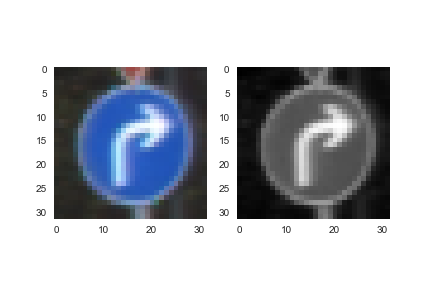

# Project: Build a Traffic Sign Recognition Program

## Data Set Summary & Exploration 

### 1. Provide a basic summary of the data set. In the code, the analysis should be done using python, numpy and/or pandas methods rather than hardcoding results manually.

I used the numpy library to calculate summary statistics of the traffic signs data set:
The size of training set is 34799
The size of the validation set is 4410
The size of test set is 12630
The shape of a traffic sign image is (32, 32, 3)
The number of unique classes/labels in the data set is 43

### 2. Include an exploratory visualization of the dataset.

Here is a histogram of classes/labels of training, validation and test set. 
Training:

 

Validation:

 

Test: 

 

From the above three figures, we know that training, validation and test sets have similar class distribution. However, the number of examples of each class is highly unbalanced. We need to upsample the minor classes to achieve a good performance.

## Design and Test a Model Architecture

### 1. Describe how you preprocessed the image data. What techniques were chosen and why did you choose these techniques? Consider including images showing the output of each preprocessing technique. Pre-processing refers to techniques such as converting to grayscale, normalization, etc. (OPTIONAL: As described in the "Stand Out Suggestions" part of the rubric, if you generated additional data for training, describe why you decided to generate additional data, how you generated the data, and provide example images of the additional data. Then describe the characteristics of the augmented training set like number of images in the set, number of images for each class, etc.)

As a first step, I decided to convert the images to grayscale because in the paper by Pierre Sermanet and Yann LeCun, using gray scale images have better performance than using color images. 
Here is an example of a traffic sign image before and after gray scaling.

 

Then, I normalized images to the range between -1 and 1, because converting inputs between 
-1 and 1 will make training of neural networks faster.

I decided to generate additional data because the number of examples of each class is highly unbalanced and this will harm the performance of the model. To add more data to the data set, I used three techniques to randomly perturb a sample image,

Random scaling:

 

Random rotation:

 

Random translation

 

I augmented those classes that have less than 1200 samples to 1200, and here is the histogram of number of samples for training set after data augmentation:

